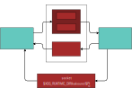

# Pykak
Pykak allows plugin authors to script Kakoune with python.

Kakscript is not indended to be a general purpose language.  If constructs like `if` or `for` are needed, a `%sh{}` expansion must be used.  However, this has 2 major drawbacks:
- starting a shell process is expensive
- shell is not an appropriate language for many tasks

The second drawback may be fixed by forking another process like python, but this makes the first drawback much worse.  Pykak aims to solve both of these issues by using IPC instead of forking new processes.

On a Ryzen 5950x, an empty `%sh{}` call takes 1.75ms and an empty `python %{}` call takes 0.129ms (averaged over 10,000 runs) for a 13.5x speedup.

### Goals
- Ease of use
- Speed
- Minimalism
- Automatic resource cleanup

### Non-goals
- Completely replacing kakscript
- Providing a python interface for every Kakoune command

### System requirements
- Kakoune
- Python 3

## Installation
If using `plug.kak`:
```
plug 'tomKPZ/pykak'
```

Otherwise, clone the repo and add the following to your `kakrc`:
```
source /path/to/pykak/pykak.kak
```

### Configuration
`pk_interpreter`: Specify which python interpreter to use.  Defaults to `python3` if not specified.

The pykak server will be lazy-loaded on the first call to `python`.  You can also manually start the server with `pk_start`.

Example configuration:
```
set global pk_interpreter pypy3 # optional; defaults to python3
pk_start # optional
```

## Usage

### Python
Python code can be run with the `python` command.  You can also use `py` which is aliased to `python`.

The last argument passed to `python` is a string of code to run.  A Kakoune `%`-string is recommended, but any [quoted string](https://github.com/mawww/kakoune/blob/master/doc/pages/command-parsing.asciidoc#quoted-strings) will do.

```python
python 'foo()'
```

### Evaluating Kakoune commands
`keval(cmds)` can be used to run Kakoune commands.  You can also use `k` which is aliased to `keval`.  Multiple commands may be separated by newlines or `;` as in regular kakscript.  Reentrancy is supported: that is, you may call `python` during `keval`.

[Default Kakoune commands](https://github.com/mawww/kakoune/blob/master/doc/pages/commands.asciidoc)

```python
python %{
    keval('echo "Hello, world!"')
}
```

### Quoting
`quote(x)`: Accepts a `str` or a `list` and returns a Kakoune-quoted `str` suitable for passing to commands.

`unquote(x)`: Converts a Kakoune-quoted `str` to a `list` of `str`.  The getters below already take care of quoting, so calling `unquote` should only be necessary when performing raw IO.

```python
python %{
    l = ['foo', 'bar', 'baz']
    keval('echo -debug ' + quote(repr(l)))
    keval('echo -debug ' + quote(l))
}
```
Output:
```
['foo', 'bar', 'baz']
foo bar baz
```

### Getters
`opt(x)`, `reg(x)`, and `val(x)` are equivalent to Kakoune's `%opt{x}`, `%reg{x}`, and `%val{x}`.  Unlike in `%sh{}` expansions, these getters fetch values on-the-fly.

Quoted variants are also available: `optq(x)`, `regq(x)`, and `valq(x)`.  The quoted variants should be used when expecting list-type data.

- [Default Kakoune options](https://github.com/mawww/kakoune/blob/master/doc/pages/options.asciidoc#builtin-options)
- [Kakoune registers](https://github.com/mawww/kakoune/blob/master/doc/pages/registers.asciidoc#default-registers)
- [Kakoune values](https://github.com/mawww/kakoune/blob/master/doc/pages/expansions.asciidoc#value-expansions)

```python
python %{
    wm_str = opt('windowing_modules')
    wm_list = optq('windowing_modules')
    keval('echo -debug ' + quote(repr(wm_str)))
    keval('echo -debug ' + quote(repr(wm_list)))
}
```
Possible output in `*debug*` buffer:
```
'tmux screen kitty iterm wayland x11'
['tmux', 'screen', 'kitty', 'iterm', 'wayland', 'x11']
```

### Arguments
The `python` command accepts arguments before the main code block.  The arguments are accessible via `args`.  While Kakoune's `%arg{n}` is 1-indexed, `args[n]` is 0-indexed.  The below snippet prints `foo bar foo bar foo bar`.

```python
python foo bar 3 %{
    keval('echo ' + quote(args[:-1] * int(args[-1])))
}
```

Arguments can be forwarded from a command to python via Kakoune's `%arg{@}`.  Running `: foo a b c` with the below snippet prints `a b c`.

```python
def foo -params 0.. %{
    python %arg{@} %{
        keval('echo ' + quote(args))
    }
}
```

### Async IO
Pykak supports running Kakoune commands asynchronously via Kakoune's socket.

`keval_async(cmds, client=None)`: Evaluate `cmds` in Kakoune.  `cmds` is allowed to contain a `python` command.  If `client` is given, `cmds` will be executed in the context of that client.  `keval_async` may be called from any thread.  Communication with Kakoune (via `keval()` or similar) is only allowed on the main thread while Kakoune is servicing a `python` command.

```python
python %{
    def foo(client):
        time.sleep(2)
        keval_async('echo hello world', client)
    threading.Thread(target=foo, args=[val('client')]).start()
}
```

### Raw IO
Raw IO may be useful to batch multiple IOs together, or to send data for each buffer with `eval -buffer *`.

`pk_send data` and `pk_sendq data`: Sends `data` from Kakoune to python.  The `q` variant sends the data quoted.  It only makes sense to run these commands during a `keval` since that's the only way to obtain the data, otherwise the data will be discarded.  `keval` returns a list of data sent from these commands.

```python
python %{
    replies = keval('''
       pk_send hello world
       pk_sendq hello world
    ''')
    keval('echo ' + quote(str(replies)))
}
```
Output: `['hello world', ['hello', 'world']]`.

```python
python %{
    buffers = keval('eval -buffer * %{ pk_send %val{buf_line_count} }')
    keval('echo ' + quote(buffers))
}
```
Possible output: `152 234`.

### Errors
If a Kakoune exception is raised during `keval`, a `KakException` will be raised in python which you can catch if desired.

If a python exception occurs that isn't caught, a stack trace will be printed out in the `*debug*` buffer.

```python
python %{
    val('this_value_does_not_exist')
}
```
Possible output in `*debug*` buffer:
```
pykak error: Traceback (most recent call last):
  File "/home/tom/.config/kak/plugins/pykak/pykak.py", line 60, in _process_request
    exec(textwrap.dedent(args.pop()))
  File "<string>", line 2, in <module>
  File "/home/tom/.config/kak/plugins/pykak/pykak.py", line 76, in getter_impl
    return keval(('pk_write_quoted d %%%s{%s}' if quoted else
  File "/home/tom/.config/kak/plugins/pykak/pykak.py", line 130, in keval
    raise KakException(data)
KakException: 2:9: 'pk_read_impl': 2:1: 'eval': no such variable: this_value_does_not_exist
```

### Persistent state
Python code is `exec()`ed from within a function, so any variables that are set will not be around for the next `python` call.  To make state persistent, variables must be declared `global`.  Pykak currently doesn't isolate code between different extensions, so it's recommended to prefix global variables with the name of the extension to avoid name conflicts.

```python
python %{
    global foo, bar, Baz
    foo = 5
    def bar(x): pass
    class Baz: pass
}
python %{
    bar(foo)
    Baz()
}
```

## Examples

### Sort selections
`| sort` will sort lines within selections.  Sometimes sorting the selection contents themselves is desired.
```python
def sort-sels %{ py %{
    sels = sorted(valq('selections'))
    # Put the selections into the default paste register,
    # then execute `R` to replace the selections.
    k('reg dquote %s; exec R' % quote(sels))
}}
```

### Alternative word movement
In Vim, `5w` operates on 5 words, but in Kakoune it selects the 5th word.  This snippet makes Kakoune match Vim's behavior.
```python
def vim-w %{ py %{
    count = int(val('count'))
    keys = 'w'
    if count > 1:
        keys += '%dW' % (count - 1)
    k('exec ' + keys)
}}
map global normal 'w' ': vim-w<ret>'
```

### Example plugin
See [counted.kak](https://github.com/tomKPZ/counted.kak) for an example of a plugin that uses pykak.

## Architecture


For synchronous communication, 3 fifos (named pipes) are used to communicate between Kakoune and Python.  In the Kakoune->Python direction, 2 pipes are used in an alternating fashion to avoid a race condition.  Otherwise, 2 requests from Kakoune sent back-to-back may appear as a single request to Python.  Using 2 fifos forces synchronization.  In the Python->Kakoune direction, only one fifo is used because it's not possible to write 2 responses from Python without a read in between to force synchronization.

On `py2kak.fifo`, only kakscript commands are sent.  On `kak2py_a.fifo` and `kak2py_b.fifo`, requests are sent with a simple protocol where the first character defines the request type:
- `r`: request (python code to run)
- `d`: data
- `e`: error
- `f`: kakoune is exiting
- `h`: heartbeat (only on systems without `pidfd` or `kqueue`)
- `a`: ack (`keval` is finished)

For asynchronous communication, Kakoune's socket is used to send kakscript commands.  Data only flows from Python to Kakoune on the socket.  The socket code is provided by [kakoune-smooth-scroll](https://github.com/caksoylar/kakoune-smooth-scroll).

Three threads are used in python:
- Main thread: Handles synchronous communication in a loop.  Executes code sent from Kakoune.
- Socket thread: Pulls async requests from a queue and sends them on Kakoune's socket.
- Exit thread: On exit, Kakoune will send a request to Python so it can cleanup resources.  But if Kakoune crashes, the exit thread will detect that.  The strategy used is different depending on the platform:
  - Linux 5.3+: `pidfd`
  - MacOS and BSD: `kqueue`
  - Other platforms: An async heartbeat is sent every minute via the socket.  If a response is not seen within another minute, Kakoune is assumed to have exited.
